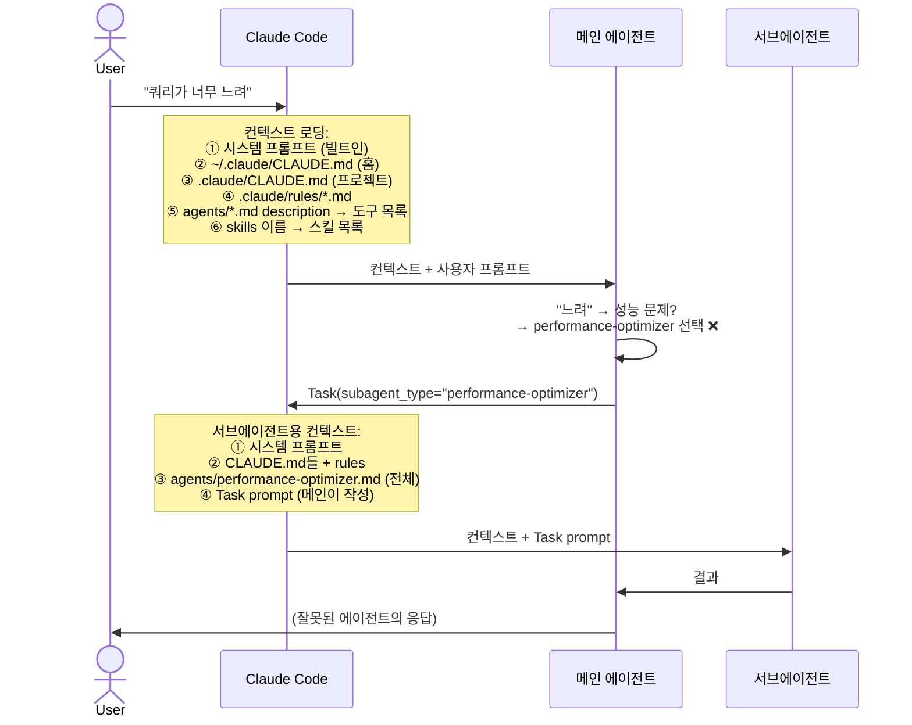
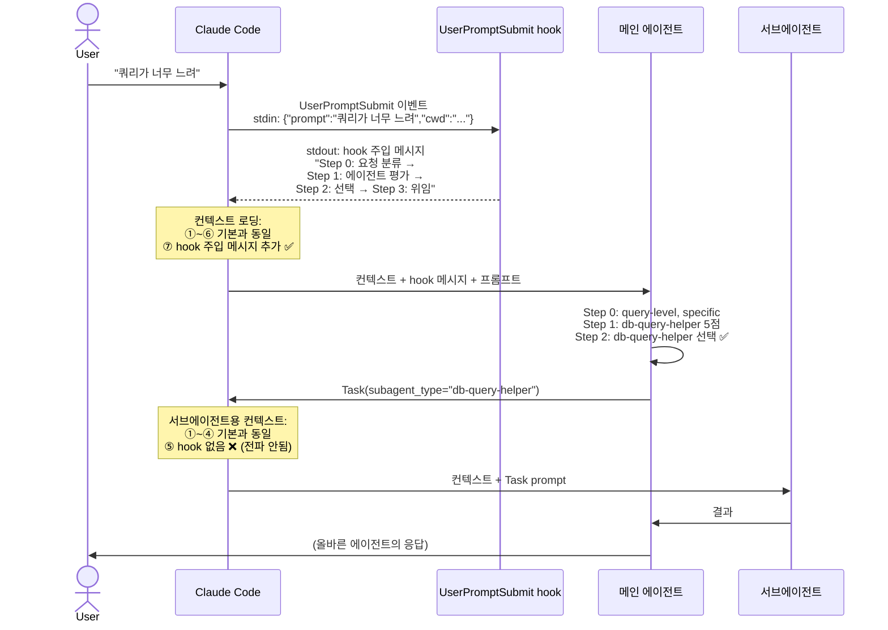

# 02 — 서브에이전트 위임 및 선택

> 어떤 설정을 써야, 메인 에이전트가 올바른 서브에이전트를 선택하는가?

## 배경

Claude Code에서 `.claude/agents/`에 커스텀 에이전트를 정의하면, 메인 에이전트가 `Task(subagent_type=...)` 도구로 작업을 위임할 수 있다. 그런데 에이전트를 아무리 잘 만들어도, 메인 에이전트가 **올바른 에이전트를 선택하는지는 보장되지 않는다.**

실제로 겪은 문제:
- `db-query-helper`를 만들어도 쿼리 관련 요청이 `performance-optimizer`나 `code-analyzer`로 간다
- `migration-planner`는 이름이 낯설어서 아예 선택되지 않는다 (선택률 0%)
- 모델이 익숙한 에이전트(Explore, code-analyzer)에 편향되어 맨날 같은 에이전트만 고른다

01 실험에서 UserPromptSubmit 훅으로 메인 세션의 Skill() 호출을 100% 유도할 수 있음을 확인했다. 하지만 **훅은 서브에이전트에 전파되지 않는다.** 메인 에이전트가 서브에이전트를 호출하는 시점에는 훅이 개입할 수 없으므로, 메인 에이전트가 "올바른 에이전트를 스스로 골라야" 한다.

이 실험은 CLAUDE.md 지시, 에이전트 description, 훅 기반 강제 평가 등 다양한 설정을 조합하여 서브에이전트 선택 정확도를 높이는 방법을 찾는다. 50%에서 시작하여 5개 버전에 걸쳐 87%까지 끌어올린 과정을 기록한다.

## 관련 파일 위치

Claude Code에서 에이전트 선택에 영향을 주는 파일들:

| 파일 | 경로 | 역할 |
|------|------|------|
| 프로젝트 CLAUDE.md | `{project}/.claude/CLAUDE.md` | 프로젝트 지시 (Agent Delegation, Available Agents 섹션) |
| 에이전트 정의 | `{project}/.claude/agents/{name}.md` | 에이전트별 역할 정의. **description 프론트매터**가 핵심 |
| hook 설정 | `{project}/.claude/settings.json` | UserPromptSubmit hook 등록 |
| hook 스크립트 | `{project}/hooks/{name}.sh` | hook이 실행하는 셸 스크립트 |
| 스킬 정의 | `{project}/.claude/skills/{name}/SKILL.md` | 스킬 가이드 (이 실험에서는 고정) |

> 홈 레벨 `~/.claude/CLAUDE.md`는 이 실험에서 사용하지 않음. 모든 설정은 프로젝트 레벨.

### 에이전트 .md 예시

```markdown
---
description: "JPA Repository와 QueryDSL 쿼리 작성 전문가. 쿼리 성능이 느린 경우에도 이 에이전트를 사용하세요."
---

# db-query-helper
...
```

→ `description` 프론트매터가 Claude Code의 Task 도구 생성 시 내부적으로 참조됨 (v3에서 발견).

### settings.json 예시

```json
// v4: 에이전트 목록 + description 주입 + 강제 평가 (Step 1→2→3)
{
  "hooks": {
    "UserPromptSubmit": [
      {"hooks": [{"type": "command", "command": "bash hooks/forced-eval.sh"}]}
    ]
  }
}

// v5: v4에 Step 0 요청 분류 추가 (Step 0→1→2→3)
{
  "hooks": {
    "UserPromptSubmit": [
      {"hooks": [{"type": "command", "command": "bash hooks/forced-eval-v5.sh"}]}
    ]
  }
}
```

→ 사용자 프롬프트 제출 시 hook 스크립트가 실행되어 시스템 메시지를 stdout으로 주입. v4는 에이전트별 적합도 채점을 강제하고, v5는 그 앞에 요청 자체를 먼저 분류하는 Step 0을 추가했다.

## 에이전트 위임 흐름

사용자가 프롬프트를 입력하면 실제로 어떤 일이 벌어지는가. hook 유무에 따라 흐름이 달라진다.

### 기본 흐름 (hook 없음 — v1~v3)



→ CLAUDE.md와 description만으로는 "느려" 키워드 편향을 극복하지 못함. **정확도 50~72%**

### hook 추가 흐름 (v4~v5)



→ hook이 사고 과정을 강제하여 키워드 편향 극복. **정확도 82~87%**

### 핵심 차이

| | 기본 (v1~v3) | hook 추가 (v4~v5) |
|---|---|---|
| 메인 컨텍스트 | 시스템 + CLAUDE.md + rules + description | + **hook 주입 메시지** |
| 서브 컨텍스트 | 시스템 + CLAUDE.md + rules + 에이전트.md 전체 | 동일 (hook 전파 안됨) |
| 에이전트 선택 | 키워드 직감 | 구조화된 평가 과정 |
| 이 실험에서 조작 | CLAUDE.md (v1~v2), description (v3) | hook 메시지 (v4~v5) |

## 실험 흐름

```
v1 위임 지시 강도       50%  ████████████████████
   "must로 강제하면 되지 않을까?" → 안 됨. 설명이 없어서 못 고름.
                                    ↓
v2 에이전트 설명 수준    62%  █████████████████████████
   "CLAUDE.md에 설명 쓰면?" → 조금 나음. 근데 description이 더 중요.
                                    ↓
v3 디스크립션 교차참조   72%  █████████████████████████████
   "에이전트 .md 자체를 개선하면?" → 큰 점프. 하지만 72%가 한계.
                                    ↓
v4 hook 기반 강제 평가     82%  █████████████████████████████████
   "01처럼 hook으로 사고를 강제하면?" → 효과적. 근데 키워드 편향이 남음.
                                    ↓
v5 Step 0 요청 분류      87%  ███████████████████████████████████
   "평가 전에 분류부터 하면?" → 키워드 편향 극복. natural 94%.
```

## 측정 지표

| 지표 | 의미 | 측정 방법 |
|------|------|----------|
| **위임률** | 메인 에이전트가 Task 도구를 **호출했는가** | stream-json 로그에서 `"name":"Task"` 존재 여부 |
| **정확도** | 호출한 서브에이전트가 **기대한 에이전트와 일치하는가** | Task input의 `subagent_type`과 테스트 케이스의 `expected_agents` 비교 |

위임률이 높아도 정확도가 낮을 수 있다 — "위임은 했는데 엉뚱한 에이전트에 보낸" 경우. 반대로 위임 자체를 거부하면(직접 처리) 위임률과 정확도 모두 실패.

```
예: "쿼리가 너무 느려" → expected: db-query-helper

✅ 위임 ✅ 정확: Task(subagent_type="db-query-helper")  → 위임률 O, 정확도 O
✅ 위임 ❌ 정확: Task(subagent_type="performance-optimizer") → 위임률 O, 정확도 X
❌ 위임:        (직접 코드 분석 시작)                    → 위임률 X, 정확도 X
```

## 테스트 케이스 유형

테스트 프롬프트는 에이전트를 특정하는 명확도에 따라 3가지 유형으로 분류된다. (`test-cases.json`)

| 유형 | 설명 | 예시 |
|------|------|------|
| **direct** (7건) | 작업을 직접 명시. 어떤 에이전트가 필요한지 명확 | "팔로우 목록 조회 쿼리를 최적화해줘" |
| **natural** (9건) | 자연어로 문제를 서술. 에이전트를 유추해야 함 | "findByNickname 쿼리가 너무 느려" |
| **ambiguous** (4건) | 범위가 넓거나 모호. 여러 에이전트가 후보 | "새 API endpoint 만들어줘" |

direct는 v4부터 100% 해결. natural은 v5에서 94%까지 도달. ambiguous는 모든 버전에서 50%가 한계.

---

## v1 — 위임 지시 강도

### 가설

"프로젝트 CLAUDE.md(`.claude/CLAUDE.md`)에 '반드시 위임하세요'라고 강하게 쓰면 위임률과 정확도가 올라갈 것이다."

### Config 상세

CLAUDE.md의 `### Agent Delegation` 섹션만 변수. 나머지(프로젝트 정보, 스킬 목록, 에이전트 이름 목록)는 동일.

| Config | CLAUDE.md Agent Delegation 섹션 |
|--------|-------------------------------|
| **none** | 섹션 자체 없음 |
| **mention** | `복잡한 작업은 Task 도구를 통해 서브에이전트에 위임할 수 있습니다.` |
| **should** | `구현 작업은 Task 도구를 통해 서브에이전트에 위임하세요.` + 예시 코드 |
| **must** | `**모든 작업은 반드시 Task 도구를 통해 서브에이전트에 위임하세요. 직접 처리하지 마세요.**` + 예시 + 금지 문구 |

모든 config에 공통으로 들어가는 에이전트 목록 (이름만, 설명 없음):

```
### Available Agents
프로젝트 커스텀 에이전트 목록 (`.claude/agents/` 디렉토리):
`api-designer`, `code-analyzer`, `db-query-helper`, `migration-planner`, `performance-optimizer`, `test-writer`
```

### 결과: 50% (가설 기각)

| Config | 위임률 | 정확도 |
|--------|--------|--------|
| none | 12/16 (75%) | 5/16 (31%) |
| mention | 14/16 (87%) | 8/16 (50%) |
| should | 11/16 (68%) | 8/16 (50%) |
| must | 13/16 (81%) | 8/16 (50%) |

위임 지시 강도는 정확도에 **영향 없음**. 모두 50% 부근. 위임은 이미 75%+ 되고 있었다. 문제는 "위임을 안 한다"가 아니라 **"올바른 에이전트를 못 고른다"**.

### 핵심 발견

- 모델이 에이전트가 뭘 하는지 모르니까 익숙한 것(code-analyzer, Explore)만 고름

### 왜 v2로 넘어갔는가

병목이 "지시 강도"가 아니라 **"에이전트 설명 부재"**임을 확인. 에이전트가 뭘 하는지 알려주면 정확도가 올라갈까?

---

## v2 — 에이전트 설명 수준

### 가설

"프로젝트 CLAUDE.md(`.claude/CLAUDE.md`)의 Available Agents 섹션에 에이전트 설명을 자세히 쓸수록 정확도가 올라갈 것이다."

### Config 상세

Agent Delegation = must 고정. v1에서 mention(87%)이 must(81%)보다 위임률이 높았지만, 정확도는 둘 다 50%로 동일했다. v1의 결론이 "지시 강도는 정확도에 무의미"였으므로, 가장 명시적인 must를 베이스라인으로 선택하여 v2의 독립변수(설명 수준)만 순수하게 비교할 수 있도록 했다. CLAUDE.md의 `### Available Agents` 섹션만 변수.

| Config | Available Agents 섹션 내용 |
|--------|--------------------------|
| **name-only** | 이름만 나열: `` `api-designer`, `code-analyzer`, ... `` |
| **one-liner** | 테이블 형태. 이름 + 한줄 설명 + 교차참조 |
| **detailed** | 에이전트별 소제목 + 2~3줄 설명 + 적합/비적합 태그 |
| **read-file** | 이름 나열 + `위임 전, 반드시 .claude/agents/{이름}.md를 Read로 읽고 선택하세요` |

> config별 CLAUDE.md 전문은 `runv2.sh`의 `generate_claude_md()` 함수 참조.

### 결과: 62% (부분 검증)

| Config | 위임률 | 정확도 |
|--------|--------|--------|
| name-only | 12/16 (75%) | 9/16 (56%) |
| one-liner | 14/16 (87%) | 8/16 (50%) |
| detailed | 11/16 (68%) | **10/16 (62%)** |
| read-file | 11/16 (68%) | 9/16 (56%) |

detailed가 62%로 최고. v1 대비 +12%p. 하지만 기대만큼 높지 않다.

### 핵심 발견

- **위임률 역설** — 설명 많을수록 위임률 **하락** (detailed 68%, read-file 68%). 에이전트 역할을 알게 되니 "내가 직접 하겠다" 판단

### 왜 v3로 넘어갔는가

프로젝트 CLAUDE.md에 설명을 아무리 써도 62%가 한계. 분석하면서 핵심 발견: Claude Code가 `Task(subagent_type=...)` 도구를 생성할 때 `.claude/CLAUDE.md`가 아니라 **`.claude/agents/{name}.md`의 `description` 프론트매터**를 내부적으로 참조한다. CLAUDE.md를 고치는 게 아니라 에이전트 .md 자체를 개선해야 한다.

---

## v3 — 디스크립션 교차참조

### 가설

"에이전트 .md(`.claude/agents/{name}.md`)의 description 프론트매터에 교차참조를 추가하면 에이전트 간 혼동이 줄어들 것이다."

### Config 상세

CLAUDE.md와 실행 스크립트(runv2.sh)는 v2와 동일. **에이전트 .md의 description 프론트매터만 변경**.

v2까지의 description (교차참조 없음):
```yaml
description: "JPA Repository와 QueryDSL 쿼리 작성 전문가"
```

v3 description (교차참조 추가):
```yaml
description: "JPA Repository와 QueryDSL 쿼리 작성 전문가. 쿼리 성능이 느린 경우에도 이 에이전트를 사용하세요. performance-optimizer는 서비스 레벨 성능 최적화용입니다."
```

→ 혼동이 잦은 에이전트 쌍(db-query ↔ perf-opt, code-ana ↔ test-wr 등)에 양방향 교차참조 추가.

### 결과: 72% (R1+R2 평균, 16건×2R)

| Config | 위임률 (R1+R2) | 정확도 (R1+R2) |
|--------|---------------|---------------|
| name-only | 27/32 (84%) | **23/32 (72%)** |
| one-liner | 27/32 (84%) | 20/32 (63%) |
| detailed | 26/32 (81%) | **23/32 (72%)** |
| read-file | 26/32 (81%) | 22/32 (69%) |

> R2 실행 시 tool 이름이 `Task` → `Agent`로 변경되어 원본 CSV는 0%로 기록됨. 로그 재분석으로 보정.

**반전**: CLAUDE.md에 아무 설명 없는 name-only가 detailed와 공동 1등 (72%). CLAUDE.md 설명보다 description 프론트매터가 훨씬 영향력이 크다.

### 핵심 발견

- **description이 선택의 핵심 변수** — Claude Code 내부 메커니즘이 description을 직접 사용
- **CLAUDE.md 설명은 부차적** — name-only(72%) = detailed(72%). description만 좋으면 됨
- **R1→R2 변동** — one-liner 56%→69% 상승, name-only 75%→69% 하락. 단일 라운드 변동성 확인

### 왜 v4로 넘어갔는가

description 최적화로 72%에 도달했지만 더 이상 올릴 여지가 보이지 않았다. 한편, 01 실험에서 **hook으로 시스템 메시지를 주입하면 행동을 100% 강제**할 수 있음을 이미 증명했다. 01은 Skill() 호출이었지만, 같은 원리를 에이전트 선택에도 적용할 수 있지 않을까?

01의 forced-eval = "각 스킬을 채점하고 최고점 호출". 이걸 변형: "각 에이전트의 적합도를 1~5점 채점 → 최고점에 위임".

---

## v4 — hook 기반 에이전트 선택

### 가설

"description 교차참조(v3) + hook 강제 평가(01)를 결합하면 정확도가 크게 올라갈 것이다."

추가 비교: 외부 LLM(Haiku 4.5)에게 정답을 물어보고 Claude에 주입하는 방식은 어떨까?

### Config 상세

CLAUDE.md는 name-only + must로 고정. `.claude/settings.json`의 UserPromptSubmit hook만 변수.

| Config | hook | 주입되는 시스템 메시지 |
|--------|-----|---------------------|
| **none** | 없음 | — |
| **simple** | `simple.sh` | `Task로 위임할 때, .claude/agents/의 에이전트 설명을 확인하고 가장 적합한 에이전트를 선택하세요.` |
| **forced-eval** | `forced-eval.sh` | Step 1~3 강제 평가 (아래 참조) |
| **llm-eval-haiku** | `llm-eval.sh` | Haiku 4.5가 에이전트를 추천 → `이 작업에 가장 적합한 에이전트는 "{name}"입니다. 반드시 Task로 위임하세요.` |

<details>
<summary>forced-eval.sh 주입 메시지 전문</summary>

```
INSTRUCTION: MANDATORY AGENT SELECTION SEQUENCE

Step 1 - EVALUATE (do this in your response):
다음 에이전트 목록에서 사용자 요청에 가장 적합한 에이전트를 선택하세요.
각 에이전트의 description을 사용자 요청과 비교하고 적합도를 평가하세요:

- api-designer: {description}
- code-analyzer: {description}
- db-query-helper: {description}
- migration-planner: {description}
- performance-optimizer: {description}
- test-writer: {description}

Step 2 - SELECT:
가장 적합한 에이전트를 하나 선택하세요. 선택 이유를 간단히 설명하세요.

Step 3 - DELEGATE:
선택한 에이전트로 반드시 Task 위임하세요:
Task(subagent_type="선택한-에이전트", prompt="사용자 요청")

CRITICAL: 반드시 위 에이전트 목록에서만 선택하세요. 직접 처리하지 마세요.
```

→ `{description}`은 `.claude/agents/*.md`의 frontmatter에서 동적 추출.
</details>

<details>
<summary>llm-eval.sh 동작 방식</summary>

1. stdin에서 `{"prompt":"사용자 요청","cwd":"..."}` 수신
2. `.claude/agents/*.md`에서 description 추출
3. Haiku 4.5 API 호출: `"사용자 요청에 가장 적합한 에이전트를 하나만 선택하세요"` (temperature=0)
4. 응답(에이전트 이름)을 Claude에 주입: `이 작업에 가장 적합한 에이전트는 "{name}"입니다.`
</details>

### 결과: 82% (검증)

| Config | 위임률 (R1+R2) | 정확도 (R1+R2) |
|--------|---------------|---------------|
| none | 34/40 (85%) | 24/40 (60%) |
| simple | 36/40 (90%) | 28/40 (70%) |
| forced-eval | 38/40 (95%) | **33/40 (82%)** |
| llm-eval-haiku | 34/40 (85%) | 28/40 (70%) |

20건 × 4 configs × 2R. forced-eval이 82%로 역대 최고.

### 핵심 발견

- **"사고 과정 강제" > "정답 알려주기"** — 가장 놀라운 발견. Haiku가 정확한 에이전트를 추천해도 Claude가 **무시하고 Explore로 보냄**. llm-haiku(70%) = simple(70%). 답을 알려주는 것보다 스스로 생각하게 강제하는 것이 효과적

### 왜 v5로 넘어갔는가

82%를 달성했지만, N03 "findByNickname 쿼리가 너무 느려"는 v1부터 v4까지 **한 번도 성공하지 못한 케이스**. "느려"라는 단어만 보고 `performance-optimizer`로 보내는 실수가 반복됨. forced-eval로 "하나씩 채점해봐"라고 시켜도, 모델이 "느려"를 보는 순간 이미 "성능 문제"로 판단이 굳어버린다.

여러 개선안을 검토했다:
1. 트리거/안티트리거 키워드 — 비범용적. 패스
2. 양방향 교차참조 — 이미 v3에서 함
3. **Step 0 요청 분류** — 에이전트를 보기 전에 요청을 먼저 구조적으로 분류 ← 채택
4. 폴백 규칙 — 보조적. 후순위

**Step 0 핵심 아이디어**: "분류 먼저, 평가 나중." N03은 "findByNickname 쿼리"라고 명시 → query-level로 분류 → db-query-helper 자연 매칭. 키워드에 바로 반응하지 않게 구조를 먼저 보게 한다.

---

## v5 — Step 0 요청 분류 추가

### 가설

"에이전트 평가 전에 요청을 먼저 분류하면 키워드 편향을 차단할 수 있다."

### Config 상세

CLAUDE.md, 에이전트 .md는 v4와 동일. hook만 `forced-eval.sh` → `forced-eval-v5.sh`로 변경.

v4 forced-eval과의 차이: **Step 0 요청 분류**가 Step 1 앞에 추가됨.

```
Step 0 - CLASSIFY the request first:
사용자 요청을 에이전트와 비교하기 전에, 먼저 요청 자체를 분류하세요:
- 작업 레벨: query-level (특정 쿼리/Repository) | service-level (서비스 로직)
             | system-level (성능/인프라) | design-level (API/스키마 설계)
- 작업 유형: 분석 | 작성/수정 | 테스트 | 설계 | 계획
- 대상 특정성: specific (파일/클래스/메서드명 언급) | general (모듈명만) | vague (대상 불명확)
```

이후 Step 1에서 `Step 0의 분류를 기반으로` 평가하라고 지시. Step 2~3은 v4와 동일.

### 결과: 87% (검증)

| Config | 위임률 (R1+R2) | 정확도 (R1+R2) |
|--------|---------------|---------------|
| forced-eval-v5 | 35/40 (87%) | **35/40 (87%)** |
| (v4 forced-eval 참고) | 38/40 (95%) | 33/40 (82%) |

v4 대비 정확도 +5%p. N03/N04/A02 안정 해결. 위임률은 소폭 하락 (95%→87%) — Step 0 분류 과정이 직접 처리 경향을 미세하게 증가시킴.

### 핵심 발견

- **N03 ✗✗ → ✓✓** — v1~v4 전 실험 최다 실패 케이스를 안정 해결. "query-level, specific" 분류로 키워드 편향 극복
- **A02 ✗✗ → ✓✓** — "design-level" 분류로 카테고리 경계 문제 해결
- **natural 83% → 94%** — 자연어 표현도 거의 완벽
- **ambiguous 50% 변동 없음** — 모호한 요청은 한계
- **위임 거부 소폭 증가** — 분류 과정이 직접 처리 경향을 미세하게 증가시킴

### 남은 문제

- **A03 전멸 지속** — "notification 모듈에 새 기능 추가해줘" — 요청 자체가 모호
- **ambiguous 50% 천장** — hook이 아닌 다른 접근(사용자에게 질문, 멀티에이전트) 필요

---

## 전체 정리

### 정확도 추이

| 버전 | 핵심 변경 | 정확도 | 변화 | 핵심 인사이트 |
|------|----------|--------|------|-------------|
| v1 | 위임 지시 강도 | 50% | — | 강도는 무의미. 설명이 없어서 못 고름 |
| v2 | CLAUDE.md에 설명 추가 | 62% | +12%p | detailed가 최고. 하지만 description이 더 중요 |
| v3 | 에이전트 .md 교차참조 | 72% | +10%p | description이 핵심 변수. CLAUDE.md는 부차적 |
| v4 | hook으로 강제 평가 | 82% | +10%p | 사고 강제 > 정답 알려주기 |
| v5 | Step 0 요청 분류 | 87% | +5%p | 분류 먼저, 평가 나중. natural 94% |

### 유형별 추이 (best config 기준)

| 유형 | v1 | v2 | v3 | v4 | v5 |
|------|-----|-----|-----|-----|-----|
| direct | 66% | 83% | 100% | 100% | 100% |
| natural | 50% | 83% | 83% | 83% | **94%** |
| ambiguous | 25% | 25% | 50% | 50% | 50% |

### 결론: 에이전트 선택 정확도를 높이려면

1. **`.claude/agents/{name}.md`의 description 프론트매터를 잘 쓴다** — 교차참조 포함 (v3, +13%p)
2. **`.claude/settings.json`에 UserPromptSubmit hook으로 구조화된 평가를 강제한다** — Step 0 분류 + Step 1~3 채점 (v4+v5, +12%p)
3. **`.claude/CLAUDE.md` 설명은 최소한으로** — name-only면 충분. description이 좋으면 CLAUDE.md는 부차적 (v3)
4. **LLM 추천보다 자체 사고 강제가 낫다** — 정답을 알려줘도 무시함 (v4)
5. **ambiguous 요청은 다른 접근 필요** — hook만으로는 50% 천장

### 파일 구조

```
02-subagent-selection/
├── PLAN.md                ← 이 파일
├── test-cases.json        ← 테스트 프롬프트 20건
├── hooks/                 ← UserPromptSubmit hook 스크립트
│   ├── simple.sh
│   ├── forced-eval.sh
│   ├── forced-eval-v5.sh
│   ├── llm-eval.sh
│   └── llm-eval-haiku.sh
├── runv1.sh               ← v1 실행 스크립트
├── runv2.sh               ← v2/v3 실행 스크립트
├── runv4.sh               ← v4 실행 스크립트
├── runv5.sh               ← v5 실행 스크립트
└── results/
    ├── v1-final/          ← 16건 × 4 configs × 1R + summary.md
    ├── v2-final/          ← 16건 × 4 configs × 1R + summary.md
    ├── v3-final/          ← 16건 × 4 configs × 1R + summary.md
    ├── v4-final/          ← 20건 × 4 configs × 2R + summary.md
    └── v5-final/          ← 20건 × 1 config × 2R + summary.md
```
