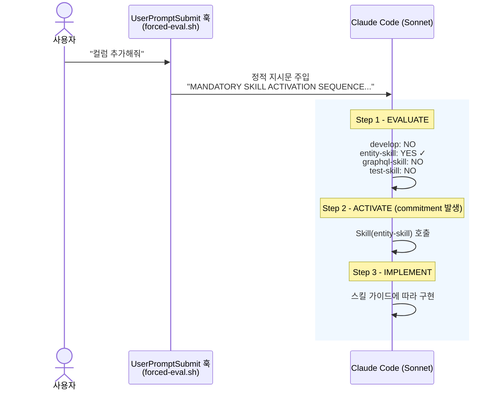
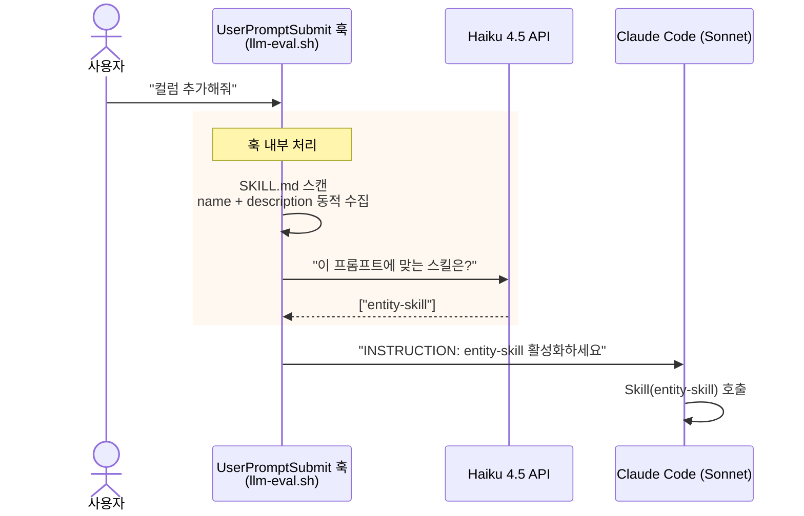

# Skill Activation 최적화 플랜

---

## 1. 실험 설계

### 1-1. 테스트 방법

Claude Code의 `UserPromptSubmit` 훅에 서로 다른 지시문(hook config)을 넣고, 동일한 프롬프트 20개를 보내 `Skill()` tool이 올바르게 호출되는지 측정.

```bash
claude -p "프롬프트" --output-format stream-json --max-turns 1
```

stream-json 출력에서 `Skill` tool_use 호출을 파싱해 정답과 대조. 각 config별로 temp dir을 격리해 훅 간 간섭을 방지.

| 항목 | 값 |
|------|-----|
| 모델 | Sonnet |
| 테스트 케이스 | 20개 (direct 6, natural 6, ambiguous 4, negative 4) |
| 테스트 대상 | 프로젝트 스킬 9개 |
| 라운드 | 2회 반복 |
| 총 실행 | 4 configs × 20 cases × 2 rounds = **160건** |

### 1-2. 테스트 케이스 유형

| 유형 | 개수 | 설명 | 예시 |
|------|------|------|------|
| direct | 6 | 스킬명을 직접 언급 | "JPA Entity 새로 만들어줘" |
| natural | 6 | 자연어로 요구사항 기술 | "User 테이블에 컬럼을 추가하고 싶어" |
| ambiguous | 4 | 여러 스킬에 걸칠 수 있는 모호한 요청 | "새 API endpoint 만들어줘" |
| negative | 4 | 스킬이 필요 없는 일반 요청 | "git log 최근 5개 보여줘" |

### 1-3. 훅 구성 (4종)

#### none (baseline)

훅 없음. Claude가 스킬 목록만 보고 자발적으로 호출하는지 측정.

#### simple

단순 지시문 한 줄을 `UserPromptSubmit` 훅으로 주입:

```
INSTRUCTION: If the prompt matches any available skill keywords,
use Skill(skill-name) to activate it before proceeding.
Check .claude/skills/ for relevant skills.
```

#### forced-eval (정적 훅)

3-step commitment mechanism. 훅이 "평가 → 호출 → 구현" 순서를 강제하는 지시문을 주입하면, Claude가 스스로 평가를 글로 쓴 뒤 그 결과에 따라 행동:



이 접근법은 Anthropic 공식 문서의 여러 프롬프트 엔지니어링 원칙에 근거:

| 원칙 | 공식 문서 인용 | forced-eval 적용 |
|------|--------------|-----------------|
| 순차적 단계 지시 | *"Provide instructions as sequential steps using numbered lists or bullet points when the order or completeness of steps matters."* | Step 1→2→3 순서를 강제해 스킵 방지 |
| Commitment mechanism | *"Choose an approach and commit to it. Avoid revisiting decisions unless you encounter new information that directly contradicts your reasoning."* | YES라고 쓰면 되돌리기 어려움 |
| 먼저 근거를 쓰게 하기 | *"Ask Claude to quote relevant parts first before carrying out its task. This helps Claude cut through the noise."* | 평가를 글로 쓰게 하면 후속 행동의 정확도가 올라감 |
| UPPERCASE 강조 | *"Where you might have said 'CRITICAL: You MUST use this tool when...', you can use more normal prompting."* | 이전 모델에서 `CRITICAL`, `MUST` 등이 tool undertriggering 방지에 효과적이었음을 인정 |

> 출처: [Prompting best practices — Claude API Docs](https://platform.claude.com/docs/en/build-with-claude/prompt-engineering/chain-of-thought)

#### llm-eval (동적 훅)

사용자가 프롬프트를 입력하면 `UserPromptSubmit` 훅이 자동 실행되어, 별도의 LLM(Haiku 4.5)이 스킬 매칭을 판단한 뒤 결과를 Claude Code에 주입하는 방식:



**핵심**: 훅 스크립트가 `.claude/skills/*/SKILL.md`를 매번 스캔하므로, 스킬을 추가/삭제해도 훅 코드를 수정할 필요 없음. Haiku에게 보내는 프롬프트도 스캔 결과로 동적 생성.

```
# Haiku에게 보내는 실제 프롬프트
Return ONLY a JSON array of skill names that match this request.

Request: User 테이블에 컬럼을 추가하고 싶어

Skills:
- develop: 새 기능 개발 — 기능 추가/구현, 채팅·피드·알림 등 ...
- entity-skill: JPA Entity 작성 — 테이블/컬럼 추가, DB 스키마 ...
- graphql-skill: GraphQL API 작성 — 클라이언트 API/endpoint ...
  ...

Format: ["skill-name"] or []
```

| 항목 | 값 |
|------|-----|
| 장점 | 스킬 추가/삭제 시 훅 코드 수정 불필요 (동적 스캔) |
| 단점 | API 키 필요, 외부 호출 지연, description 품질에 크게 의존 |
| 비용 | ~$0.0005/회 (Haiku 4.5, temperature 0) |

---

## 2. 프론트메터 (Description) 최적화

### 2-1. v1 → v2 변천

| 스킬 | v1 (제목형) | v2 (트리거 키워드형, 현재) |
|------|-----------|------------------------|
| develop | 새 기능 개발 워크플로우 가이드 | 새 기능 개발 — 기능 추가/구현, 채팅·피드·알림 등 도메인 기능을 만들거나 추가할 때 사용 |
| entity-skill | JPA Entity + Repository 작성 가이드 | JPA Entity 작성 — 테이블/컬럼 추가, DB 스키마 변경, 새 도메인 모델 생성 시 사용 |
| graphql-skill | GraphQL 스키마 및 리졸버 작성 가이드 | GraphQL API 작성 — 클라이언트 API/endpoint 추가, mutation/query 정의, 프로필 수정 등 사용자 향 API 개발 시 사용 |
| grpc-skill | gRPC 서비스 및 Proto 정의 작성 가이드 | gRPC 내부 통신 — 서비스 간 데이터 전달, Proto 정의, 마이크로서비스 간 호출이 필요할 때 사용 |
| gradle-skill | 멀티모듈 Gradle 빌드 관리 가이드 | Gradle 빌드 관리 — 빌드 오류 수정, 의존성/라이브러리 추가, build.gradle 설정 변경 시 사용 |
| test-skill | JUnit5 + Mockito 테스트 작성 가이드 | 테스트 작성 — 기능 검증, 동작 확인, 단위/통합 테스트, JUnit5 + Mockito 테스트 코드 작성 시 사용 |
| plan-skill | 태스크 및 구현 계획 작성 가이드 | 구현 계획 작성 — 스프린트 계획, 기능 정리, 구현 순서 설계, 태스크 분해 시 사용 |
| adr-skill | Architecture Decision Record 작성 가이드 | ADR 작성 — 아키텍처 결정 기록, 기술 전환/선택 문서화, 의사결정 히스토리 관리 시 사용 |
| skill-creator | 새로운 스킬을 생성하는 메타스킬 | 스킬 생성 — 반복 패턴 자동화, 새로운 커스텀 스킬 만들기, 워크플로우 템플릿화 시 사용 |

### 2-2. 변경 효과 (v1 vs v2 실측)

v1과 v2를 동일 조건(OMC 격리, 20케이스, 2라운드)으로 측정한 결과:

| Config | v1 (제목형) | v2 (트리거 키워드형) | 변화 |
|--------|-----------|-------------------|------|
| none | 52% | **75%** | **+23pp** |
| simple | 57% | **85%** | **+28pp** |
| llm-eval (4.5) | 65% | **92%** | **+27pp** |
| forced-eval | 100% | **100%** | 동일 |

description을 "~가이드" 제목형에서 "~시 사용" 트리거 키워드형으로 바꾼 것만으로 **+23~28pp 상승**. forced-eval만 동일한 이유는 3-step commitment mechanism이 description 품질과 무관하게 100% 활성화를 보장하기 때문.

효과가 집중된 곳은 **natural/ambiguous 카테고리**:

- v1 natural: none 기준 1/6 정답 → v2: 5/6 정답
- v1 ambiguous: none 기준 0/4 정답 → v2: 2/4 정답
- direct/negative는 v1에서도 안정적 (제목만으로도 직접 매칭 가능)

### 2-3. 작성 원칙 (실험에서 도출)

1. **"한 줄 요약 — 트리거 키워드 나열" 패턴**: `"JPA Entity 작성 — 테이블/컬럼 추가, DB 스키마 변경, 새 도메인 모델 생성 시 사용"`
2. **동사 포함**: "추가", "수정", "작성", "생성" 등 사용자가 실제 쓰는 동사
3. **도메인 용어 포함**: "채팅", "피드", "알림", "JUnit5", "Mockito" 등 구체적 키워드
4. **"~시 사용" 종결**: 용도가 명확하게 끝맺음
5. **범용 표현 배제**: "모든 요청에 사용", "필요할 때 사용" 같은 catch-all 금지

---

## 3. 최종 결과 (v2 기준)

### 3-1. 전체 결과

| Config | R1 | R2 | 평균 | 비고 |
|--------|-----|-----|------|------|
| none | 80% | 70% | **75%** | 훅 없음 — description만으로 75% |
| simple | 90% | 80% | **85%** | 단순 지시문 |
| **forced-eval** | **100%** | **100%** | **100%** | 3-step commitment mechanism |
| llm-eval (4.5) | 95% | 90% | **92%** | Haiku 4.5 사전 평가 |

### 3-2. Forced eval vs LLM eval 비교

| 항목 | Forced eval | LLM eval (Haiku 4.5) |
|------|-------------|----------------------|
| **Accuracy** | **100%** | 92% |
| **과호출** | 빈번 (N01: 6개 동시 호출) | 없음 (항상 1개) |
| **스킬 추가/삭제** | 훅 수정 불필요 | **훅 수정 불필요 (동적 스캔)** |
| **외부 의존** | 없음 | API 키 + 네트워크 |
| **비용** | 무료 | ~$0.0005/회 |
| **description 의존도** | 낮음 (v1도 100%) | 높음 (v1 65% → v2 92%) |

---

## 4. 개선 과제

### 4-1. 약점 케이스 — 프론트메터 보강이 필요한 곳

| 케이스 | 문제 | 보강 방향 |
|--------|------|----------|
| A05 "빌드가 깨졌어 고쳐줘" | llm-eval에서 persistent miss | gradle-skill description에 "빌드 오류", "빌드 실패", "컴파일 에러" 키워드 추가 |
| N01 "채팅에 이미지 전송 기능 추가" | forced-eval에서 6개 과호출 | develop description에 "새 기능 구현의 시작점" 같은 우선순위 힌트 |
| A02 "데이터 모델 설계해줘" | none/simple에서 missed | entity-skill description에 "데이터 모델", "스키마 설계" 키워드 추가 |
